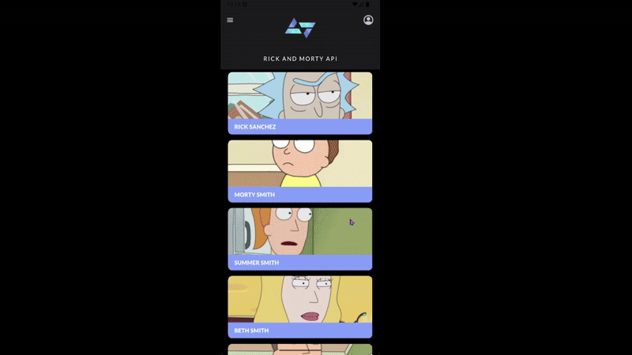
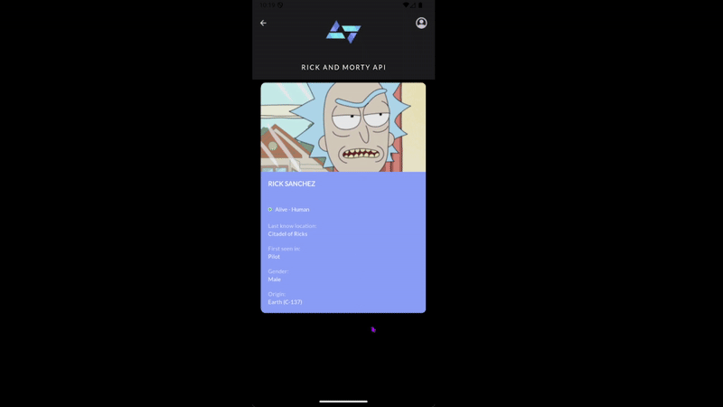
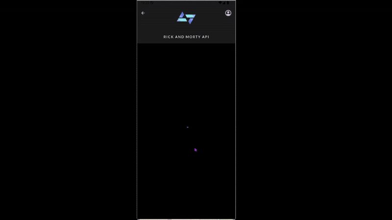

# 🚀 Rick and Morty App - Desafio KOBE

Este repositório contém a solução desenvolvida para o desafio de construção de um aplicativo móvel em Flutter para fãs de Rick and Morty, consumindo a [The Rick and Morty API](https://rickandmortyapi.com/) (REST).  
O foco principal foi a **fidelidade ao design de alta qualidade do Figma** e a **aplicação de boas práticas de desenvolvimento**.

---

## 🎯 O Desafio

O objetivo era criar um aplicativo Flutter que permitisse aos usuários:

- Exibir uma **lista de personagens** da série.
- Visualizar **detalhes completos** de cada personagem.
- Seguir um protótipo de **alta fidelidade** fornecido, replicando cada detalhe visual.

---

## ✨ Funcionalidades Implementadas

### ✅ Funcionalidades Obrigatórias (Fidelidade ao Figma)

#### 📋 Listagem de Personagens:

- Exibe uma **lista paginada** de personagens.
- Cada card de personagem apresenta a **imagem e o nome** em um layout sobreposto, replicando o design do Figma.
- A lista é **vertical** e permite **rolagem suave**.



#### 👤 Tela de Detalhes do Personagem:

- Ao clicar em um personagem, o usuário é direcionado a uma tela com **informações detalhadas**.
- Exibe: **Nome, Imagem, Status, Espécie, Gênero, Origem, Última Localização e Primeira Aparição**.
- O **Status** é indicado por uma **bolinha colorida**:
  - 🟢 Verde para `"Alive"`
  - 🔴 Vermelho para `"Dead"`
  - ⚪️ Cinza para `"Unknown"`

- Detalhes como **Gênero**, **Origem**, **Última Localização** e **Primeira Aparição** são apresentados no formato:
  - `Rótulo em cima`  
  - `Valor embaixo`, com tipografia e opacidade fiéis ao design.

- A **Primeira Aparição** (nome do episódio) é buscada dinamicamente com uma **chamada secundária** à API de episódios.



#### 🔁 Navegação Intuitiva:

- **Transições suaves** entre a tela de listagem e a tela de detalhes.
- A AppBar se adapta dinamicamente:
  - Mostra o **ícone de menu** na tela inicial.
  - Mostra o **ícone de voltar** na tela de detalhes.



---

### 💡 Funcionalidades Adicionais (Além do Escopo Mínimo)

#### 🎛️ Filtros Avançados por Categoria:

- Sistema de **filtros acessível pelo menu** (ícone na AppBar).
- Categorias de filtro:
  - **Status**
  - **Espécie**
  - **Gênero**
- Cada categoria é um `ExpansionTile` (seção expansível).
- **Seleção única** por categoria (RadioListTile).
- Botões:
  - **"Limpar Filtros"**
  - **"Aplicar Filtros"**  
  Com **feedback visual de clique**.


---

## 🛠️ Aspectos Técnicos e Decisões de Arquitetura

### 📱 Flutter & Dart

- Utilização do SDK Flutter para desenvolvimento de aplicativos móveis multiplataforma.

### 🌐 Consumo de API REST (Dio)

- Integração com a The Rick and Morty API usando o pacote `dio`.
- Camada de `Repository` encapsula a lógica de chamada da API.
- Utilização de `FutureBuilder` para requisições assíncronas, especialmente para buscar o nome do episódio da **Primeira Aparição**.

### 🧱 Arquitetura Modular

- Organização em camadas:
  - `data` (models, repository)
  - `components` (widgets reutilizáveis)
  - `pages` (telas)
  - `theme` (cores e estilos)

- Aplicação do **Single Responsibility Principle** para facilitar manutenção e legibilidade.

### 🎨 Fidelidade ao Design (Figma - Pixel Perfect)

- `AppBar` com `Stack` e `Positioned` para sobreposição de elementos.
- Cards de personagem com `Stack` para layout visual fiel.
- Tipografia com **Google Fonts (Lato)** ajustada `pixel a pixel`.
- Paleta centralizada em `app_colors.dart`.

### 🧠 Gerenciamento de Estado

- Uso de `StatefulWidgets` e `setState` para atualizar a UI eficientemente nas páginas como `HomePage` e `FilterDrawer`.

---

## 🚀 Como Rodar o Projeto

### ✅ Pré-requisitos

Certifique-se de ter instalado:

- ✅ **Flutter SDK (versão estável)** – [Guia de Instalação](https://docs.flutter.dev/get-started/install)
- ✅ **Android Studio** (com o SDK Android configurado)
- ✅ **VS Code** (com extensões Flutter e Dart)
- ✅ **Git**

---

### ▶️ Executando o Aplicativo

1. **Clone o repositório:**

   ```bash
   git clone https://github.com/Fernanda-Barreto/kode-start.git
     ```
2. **Acesse a pasta do projeto:**
    ```bash
    cd kode-start/desafio_kobe/rick_and_morty_app
     ```
3. **Instale as dependências:**
    ```bash
    flutter pub get
     ```
4. **Verifique o ambiente (opcional):**
    ```bash
    flutter doctor
     ```
     Resolva eventuais problemas apontados (como licenças ou SDK ausente).
5. **Verifique o ambiente (opcional):**
    ```bash
    flutter run
     ```
O aplicativo será compilado e iniciado no dispositivo selecionado.
