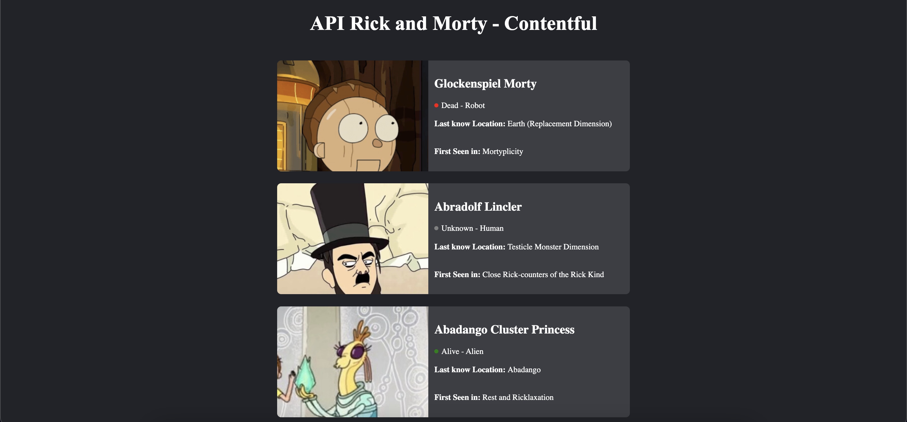
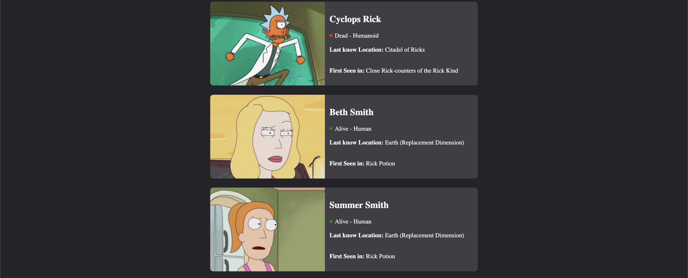

<h1 align="center">Api Rick and Morty Contentful</h1>

<h1 align="center">
    <a href="https://pt-br.reactjs.org/">🔗 React</a>
</h1>
<p align="center">🚀 Aplicação criada para consolidar os conhecimentos adquiridos sobre o Contentful</p>
## 💻 Sobre o projeto

O projeto foi desenvolvido para mostrar os dados dos personagens da série Rick and Morty.

As informações coletadas são:

- Name
- Status
- Specie
- Last known location
- First seen in

### 🎨 Demonstração da Aplicação Web

<p align="center" style="display: flex; align-items: flex-start; justify-content: center;">

  
</p>
## 🛠 Tecnologias

As seguintes ferramentas foram usadas na construção do projeto:

- ReactJS
- Contentful

## 🚀 Utilizando o Contentful

Utilizamos o Contentful para guardar as informações dos personagens, para utiliza-lo siga o passo a passo disponibilizado abaixo:

<a href="https://coda.io/d/Kode-Start-Treinamentos_dfYQYdX94AW/Passo-a-passo_suqV6#_luhR4">
  
</a>

### 🧭 Rodando a aplicação web

```
# Clone este repositório
$ git clone https://github.com/kobeapps/kode-start

# Acesse a pasta do projeto no seu terminal/cmd
$ cd projects
$ cd workshop
$ cd rick-morty

# Instale as dependências
$ npm install ou yarn

# Execute a aplicação em modo de desenvolvimento
$ npm run start ou yarn start

# A aplicação será aberta na porta:3000 - acesse http://localhost:3000

```

<p align="center">Feito com ❤️ por Lari e Fran 👋🏽
